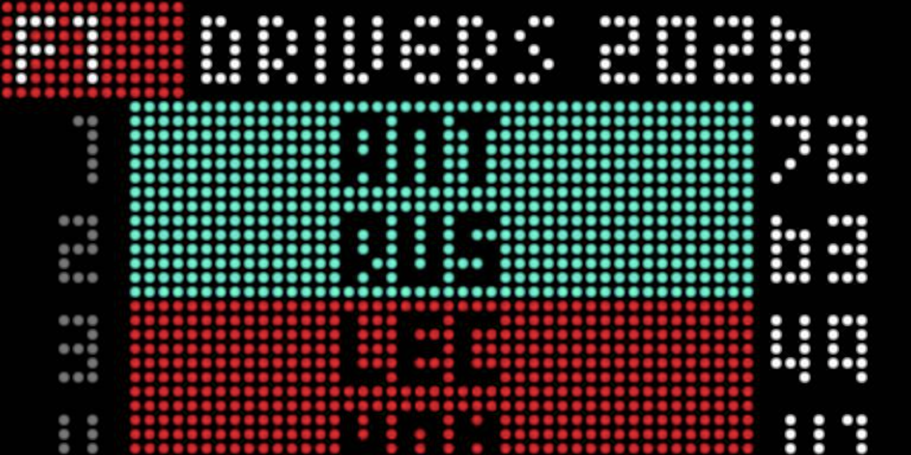
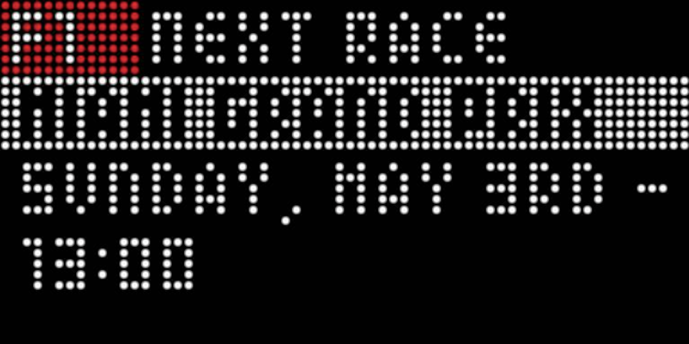

#F1 Standings Board
A **F1 Standings and Next Race** plugin board for the [NHL LED Scoreboard](https://github.com/falkyre/nhl-led-scoreboard) F1 Standings displays upcoming both the driver and constructor championship standings. F1 Next Displays upcoming race details.

Data comes from the [Jolpica F1 API](https://github.com/jolpica/jolpica-f1)




## Features
 - Scrolling drivers Standings
 - Scrolling constructors Standings
 - Optionally display only top n number of drivers instead of all
 - Next Race Details of date time, location, and sessions
 - Show next race times with track or local time in 24 or 12 hours

## Installation

1. Use the NHL Led Scoreboard's plugin manager python script to install:

   ```bash
   python plugins.py add https://github.com/Tdflowers/nls_plugin_f1_board
   ```
2. Duplicate the config.default.json as config.json
3. Add `f1_standings` and/or `f1_next` your scoreboard config and restart the scoreboard

## Configuration

To customize the `f1_standings` configuration, copy the sample config to config.json and edit it.

```bash
cp config.default.json config.json
nano config.json
```

## Config Fields
 - refresh_minutes - number of minutes to wait before refreshing (eg 60, 120, 240)
 - scroll_speed - how fast the list will scroll 0.08
 - rotation_rate - how many seconds the board is on screen (eg 5, 10 30),
 - show_drivers - should the board show the drivers standings? (true or false)
 - show_constructors - should the board show the constructors standings? (true or false)
 - top_n - how many drivers or constructors should show on the list. use 0 for all. 
 - use_local_time - Show track or local time for times of the weekend
 - time_24h - show in 24 or 12 hour time

 Example Config
 ```{
    "refresh_minutes": 240,
    "scroll_speed": 0.08,
    "rotation_rate": 5,
    "show_drivers": true,
    "show_constructors": true,
    "top_n": 0,
    "use_local_time": true,
    "time_24h": false
}
```

## Note on the API
Jolpica F1 is managed by humans and thus is updated on mondays. This means you won't see the updated standings directly after the race is completed and will need to wait til the following monday for the standings to update.
